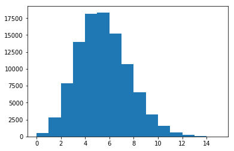
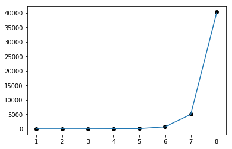
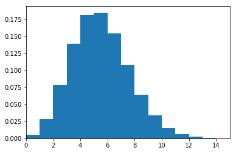

```{r setup, include=FALSE}
options(htmltools.dir.version = FALSE)
```

background-image: url(card_overlaps_problem.png)
background-size: contain

---
class: inverse, center, middle

# Simulating!

---

```{python, eval=FALSE}
from numpy.random import choice
```

```{python, eval=FALSE, tidy=FALSE}
n_experiments = 100000
overlaps = np.zeros(n_experiments)

for i in range(n_experiments):
    shop_1 = choice(2000, size = 100, replace = False)
    shop_2 = choice(2000, size = 100, replace = False)

    overlap = len(set(shop_1) & set(shop_2))
    overlaps[i] = overlap
```

```{python, eval=FALSE}
plt.hist(overlaps, bins = np.unique(overlaps))
```



---

class: inverse, center, middle

# But what if we want an exact answer?

---

class: center, middle

# Combinatorics

_Combinatorics is the branch of mathematics studying the **enumeration**, **combination**, and **permutation** of sets of elements and the mathematical relations that characterize their properties._<sup>1<sup>

.footnote[
[1] http://mathworld.wolfram.com/Combinatorics.html
]

---

# Today

 - Some kind of _Combinatorics 101_ (but not with balls and urns)
 - Problem examples and approaches to solve them

---

# Shuffling cards

 - In how many ways can the letters `cards` be ordered?
 
 - `_____` `5____`
 - `a____` `54___`
 - `ar___`
 - `ars__`
 - `arsc_`
 - `arscr`
 
---

# Permutations

$n$ items can be reordered in $n! = n\cdot(n-1)\cdot(n-2)\cdot\ldots \cdot 2\cdot 1$ ways

---

# Permutations grow fast
Stirling's approximation<sup>1</sup>

$$ n! \sim \sqrt{2\pi n} \left(\frac{n}{e}\right)^n$$

  


.footnote[
[1] https://en.wikipedia.org/wiki/Stirling's_approximation
]
---

class: inverse, center, middle
background-image: url(lidl_factorial.jpg)
background-size: contain

# Permutations grow fast

# 362 880

---

In how many ways can we draw 100 unique cards from 2000 possible cards?

$$2000\cdot 1999\cdot 1998\cdot \ldots \cdot 1901$$
$$ = \frac{2000!}{1900!}$$

But the order does not matter!

How many reorderings of these 100 cards are there? $100!$
$$ \frac{2000!}{1900!\cdot100!} = {2000 \choose 100} $$

---

# Combinations

Choosing $k$ objects from $n$ objects without repetition, order does not matter
$$ {n \choose k} = \frac{n!}{k!\cdot (n-k)!}$$

.footnote[
`R`: `choose(n, k)`  
`python`: "Why not write it yourself?"
]
---

Some examples of combinations

Safe combination is not a combination!

---

# Calculating overlap

  1) Let shop A choose 100 cards: ${2000 \choose 100}$  

  2a) Overlap of 0: ${1900 \choose 100}$  
  2b) Overlap of 1: ${100\choose 1}\cdot{1900 \choose 99}$  
  2c) Overlap of $n$: ${100\choose n}\cdot{1900\choose 100-n}$  

  3) Number of ways of $n$ overlap: ${2000 \choose 100}\cdot{100\choose n}\cdot{1900 \choose 100-n}$  
  4) Probability of $n$ overlap: ${2000 \choose 100}\cdot{100\choose n}\cdot{1900 \choose 100-n} / {2000 \choose 100}{2000 \choose 100}$

---

```{python, eval=FALSE}
from math import factorial

def choose(n, k): 
    return factorial(n) // factorial(n-k) // factorial(k)
```

```{python, eval=FALSE}
probs = []
for overlap in range(100):
    probs.append(
        choose(100, overlap) * choose(1900, 100-overlap) /
        choose(2000, 100)
    )
```



---

class: inverse, center, bottom
# Hypergeometric distribution<sup>1</sup>

.footnote[
[1] https://en.wikipedia.org/wiki/Hypergeometric_distribution
]

---

# Confusion matrix

$$\begin{bmatrix} a & b\\ c & d \end{bmatrix}$$

How many confusion matrices exist with 100 observations?

100 stars, 3 bars

$$103\choose 3$$


---

# Stars and bars

★ | ★ ★ ★ |★ |★ ||||


---

# Bootstrapping

In how many ways can we select (with replacement) $n$ observations from a dataset of $n$ observations?

$$n^n$$

---


